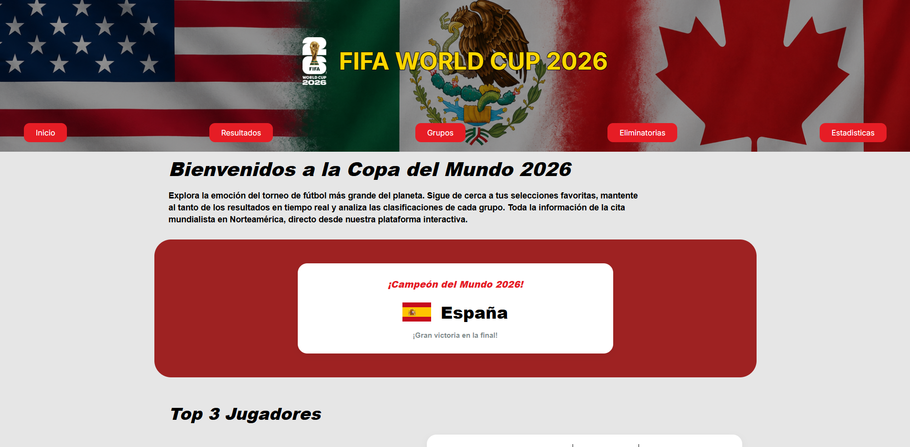
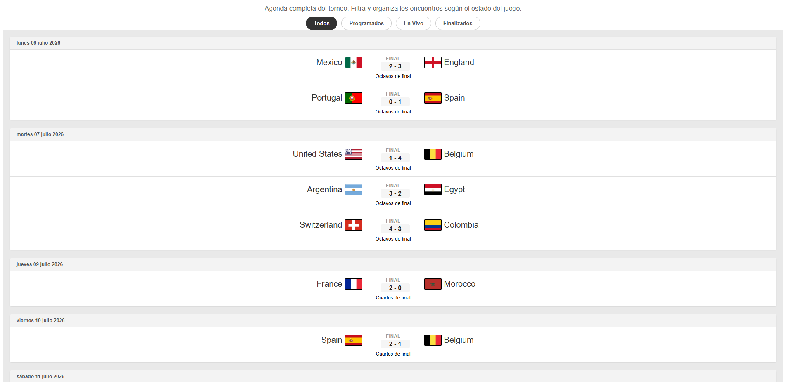
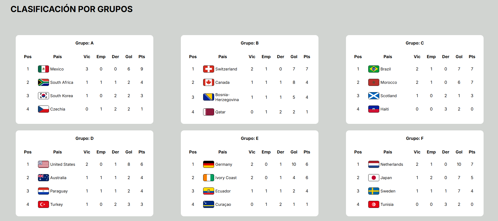
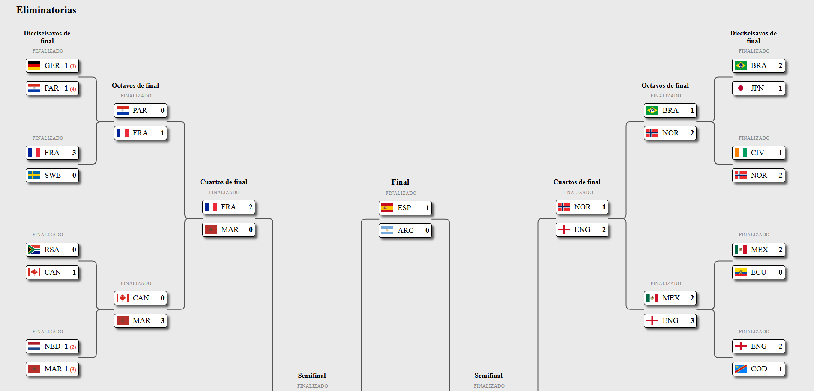
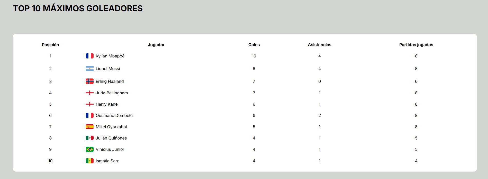

# FIFA World Cup 2026

Proyecto web informativo e interactivo sobre la **Copa Mundial de la FIFA 2026**, desarrollado con **HTML5**, **CSS3** y **JavaScript**.

---

## 📌 Descripción del proyecto

Este proyecto presenta una experiencia de usuario diseñada para seguir el torneo completo de la Copa del Mundo 2026. Incluye:

- Página principal de bienvenida con resumen del torneo y panel de destacados.
- Página de resultados de partidos con filtros y datos dinámicos.
- Clasificaciones de grupos con información de posiciones, goles y puntos.
- Árbol de eliminatorias para visualizar el camino hacia la final.
- Estadísticas del torneo con rankings de equipos y jugadores.

El sitio está construido como un proyecto educativo y demostrativo de buenas prácticas web.

---

## 🧩 Estructura del proyecto

- `index.html` — Página de inicio
- `HTML/Groups.html` — Clasificación por grupos
- `HTML/gamesResult.html` — Resultados y partidos
- `HTML/eliminationTree.html` — Árbol de eliminatorias
- `HTML/stadistics.html` — Estadísticas del torneo
- `CSS/` — Estilos para cada página
- `JS/` — Lógica de interacción y generación dinámica de datos
- `JSON/` — Datos locales de ejemplo para la aplicación
- `Img/` — Recursos de imagen utilizados en la web

---

## 🎯 Objetivos del proyecto

1. Crear una experiencia visual atractiva y coherente con el tema de la Copa Mundo 2026.
2. Diseñar una estructura HTML semántica y accesible.
3. Desarrollar interacción con JavaScript para mostrar datos dinámicos.
4. Aplicar estilos responsivos que funcionen correctamente en dispositivos móviles y de escritorio.
5. Documentar el proyecto para facilitar su presentación y mantenimiento.

---

## 🧪 Tecnologías utilizadas

- HTML5
- CSS3
- JavaScript
- JSON local
- Fuentes de Google Fonts

---

## 👥 Equipo de trabajo

- Juan Camilo Piamba
- Jesús González Gómez
- Wilfredy Salcedo
- Oscar Eduardo Perez

---

## 📁 Detalle de páginas

### 1. Inicio
- Bienvenida al torneo.
- Mostrar champión, top de jugadores y top de equipos.
- Navegación principal a todas las secciones.

### 2. Resultados
- Lista de partidos con estados programado, en vivo y finalizado.
- Datos de marcador y detalles del encuentro.

### 3. Grupos
- Tabla de posiciones por grupo.
- Estadísticas de partidos jugados, ganados, empatados, perdidos, goles y puntos.

### 4. Eliminatorias
- Árbol de fase final.
- Visualización de cruces y rutas hacia la final.

### 5. Estadísticas
- Rankings de goleadores.
- Equipos con mejores registros.
- Métricas de rendimiento del torneo.

---

## 🖼 Capturas de pantalla

### Página principal
- Inicio: 

### Resultados
- Resultados: 

### Grupos
- Grupos: 

### Eliminatorias
- Eliminatorias: 

### Estadísticas
- Estadísticas: 

---

## 🌐 Enlace de despliegue

- Vercel: [Enlace a Vercel](https://world-cup2026-henna-chi.vercel.app/)

---

## 🚀 Cómo ejecutar el proyecto localmente

1. Clona o descarga el repositorio.
2. Abre la carpeta del proyecto en tu editor.
3. Abre `index.html` en el navegador o usa una extensión de servidor local.

> Si usas VS Code, instala `Live Server` y abre el archivo con `Open with Live Server`.

---

## 📝 Notas adicionales

- El proyecto está pensado para ser un prototipo informativo y educativo.
- Las rutas de imagen y los recursos deben mantenerse consistentes con la estructura de la carpeta.

---

## 📬 Contacto

Para dudas o mejoras, contactar al equipo de desarrollo.
